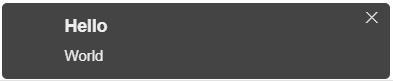

**导入文件**
```html
<link rel="stylesheet" href="./css/jquery.tips.css">
<script type="text/javascript" src="https://cdn.bootcss.com/jquery/3.4.1/jquery.min.js"></script>
<script type="text/javascript" src="./js/jquery.tips.js"></script>
```

**如何使用**
```javascript
$.tips({
    text: "World", // 文本
    heading: 'Hello', // 标题
    icon: '', // 图标
    showHideTransition: 'slide', // 过渡    fade, slide , plain
    allowTipsClose: true, // 允许Tips关闭     true , false
    hideAfter: 3000, // false 隐藏时间（ms）
    stack: 5, // false 提示数量
    position: 'bottom-left', // bottom-left or bottom-right or bottom-center or top-left or top-right or top-center or mid-center or an object representing the left, right, top, bottom values
    
    bgColor: '#444444',  // 背景颜色
    textColor: '#eeeeee',  // 文本颜色
    textAlign: 'left',  // 文本对齐
    loader: false,  // 显示进度条    true ， false
    loaderBg: '#408080',  // 进度条颜色
    beforeShow: function () {}, // Tips显示前的伴随事件
    afterShown: function () {}, // Tips显示后的伴随事件
    beforeHide: function () {}, // 提示隐藏之前触发
    afterHidden: function () {}  // 提示隐藏之后触发
})
```

